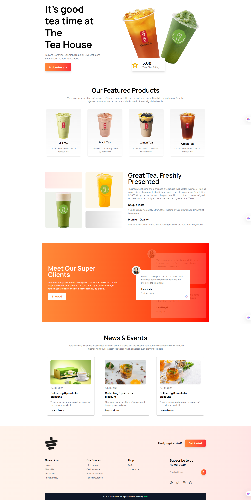
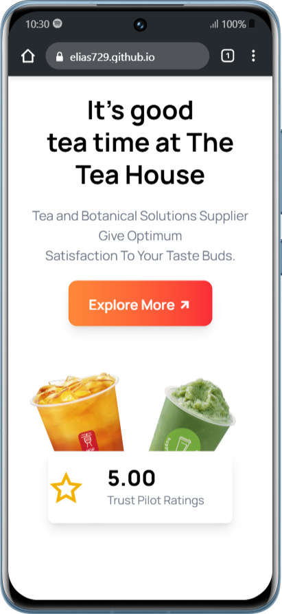
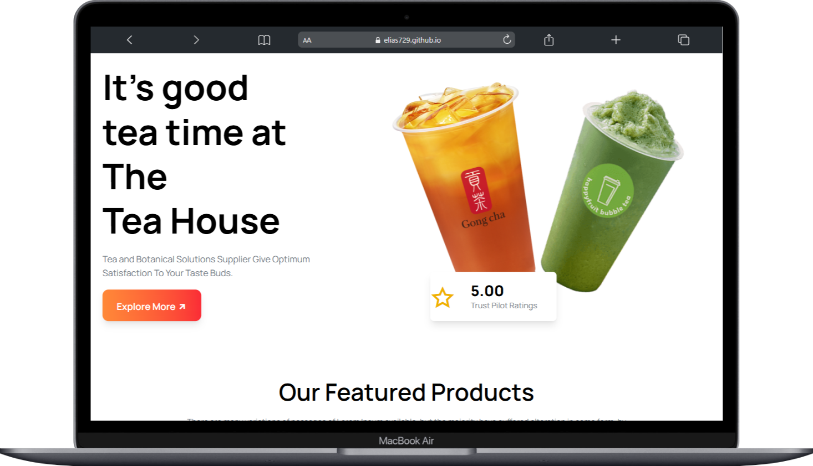

# 🍵 Tea House  

Welcome to **Tea House** – a modern, responsive website built to showcase the love for tea.  
This project highlights different types of teas with clean UI design, smooth responsiveness, and a fresh presentation.  

---

## 🔗 Live Demo  
👉 [View Tea House Website](https://elias729.github.io/tea-house/)  

---

## 📂 Repository  
👉 [GitHub Repo](https://github.com/Elias729/tea-house)  

---

## ✨ Key Features  

✅ Fully **Responsive Design** – works seamlessly on mobile, tablet, and desktop  
✅ Stylish **UI with Tailwind CSS** – modern layout with clean typography  
✅ Showcases different **tea categories** – Milk Tea, Black Tea, Lemon Tea & more  
✅ Informative content section with tea benefits  
✅ Smooth layout with proper alignment & spacing  
✅ Footer with copyright  

---

## 🛠️ Tech Stack  

- **HTML5** – for structure  
- **CSS3** – for styling  
- **Tailwind CSS** – for modern responsive design  

---

## 📸 Screenshots  

### 💻 Responsive (Desktop View)  
  

### 📱 Responsive (Mobile View)  
  

### 💻 Responsive (MacBook View)    
  

---

## 🚀 Getting Started  

Follow these steps to run the project locally:  

```bash
# Clone the repository
git clone https://github.com/Elias729/tea-house.git

# Open the project folder
cd tea-house

# Run the project
Open index.html in your browser
